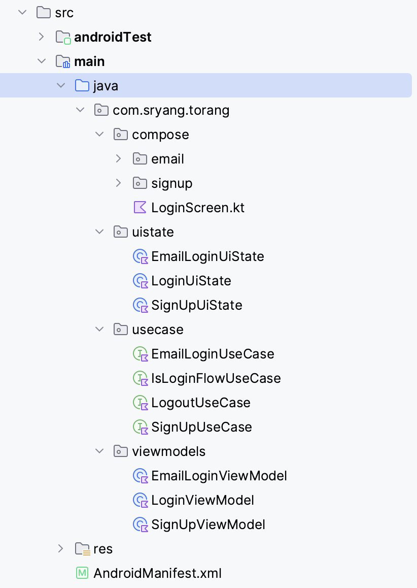
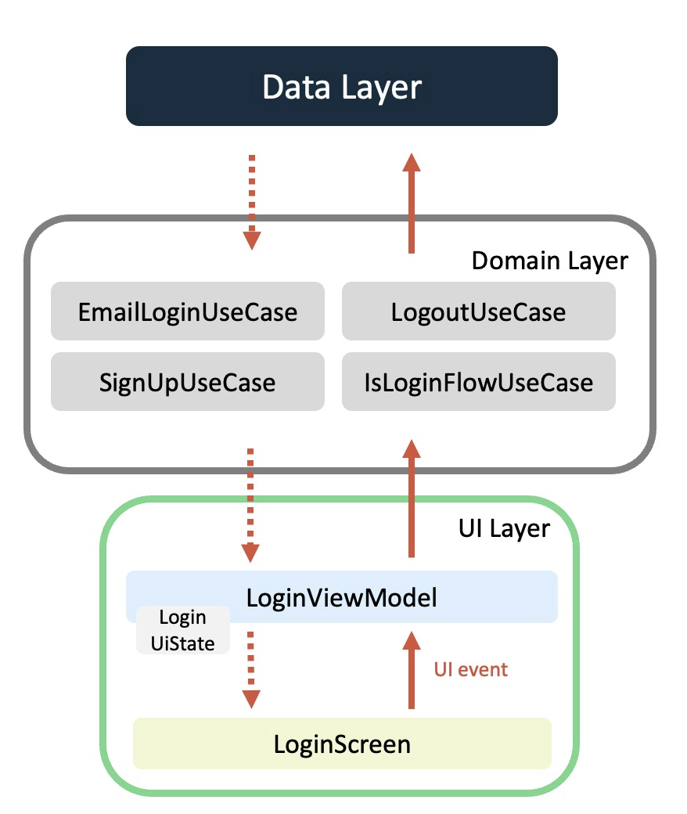

## Convention

### package



### Function

- Login + Screen
- SignUp + Screen
- EmailLogin + Screen

- EmailLogin + UseCase
- IsLoginFlow + UseCase
- Logout + UseCase
- SignUp + UseCase

- EmailLogin + ViewModel
- Login + ViewModel
- SignUp + ViewModel

## Architecture

### UI Layer

#### UI element

UI elements such as activities and fragments that display the data

- OutlinedTextField
    - supportingText : 입력 필드 하단에 작은 글씨로 정보 제공
    - trailingIcon : 입력 필드 끝에 아이콘 배치
    - keyboardOptions : 키보드 엔터 자리 다른 버튼으로 변경 가능
    - keyboardActions : 탭키나 엔터 키 눌렀을 때 다음 필드로 입력 가능하게 설정 가능

#### UI state

- The UI state is what the app says they should see.
- UI can be encapsulated in a UiState data class

```
data class EmailLoginUiState(
    val email: String = "",
    val password: String = "",
    val isProgress: Boolean = false,
    val error: String? = null,
    val emailErrorMessage: String? = null,
    val passwordErrorMessage: String? = null
)
```

```
data class SignUpUiState(
    val name: String = "",
    val email: String = "",
    val confirmCode: String = "",
    val password: String = "",
    val isProgress: Boolean = false,
    val emailErrorMessage: String? = null,
    val passwordErrorMessage: String? = null,
    val confirmCodeErrorMessage: String? = null
)
```

#### State holder(ViewModel)

Responsible for the production of UI state and contain the necessary logic for that task

```
```

## Illustrating cycle of event
