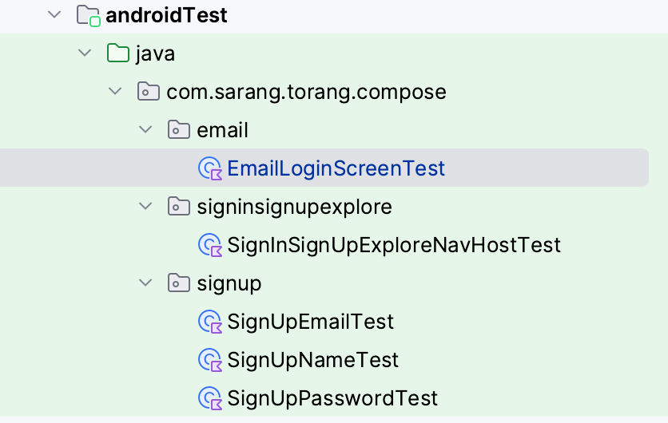

# Compose Test

## Compose Test 환경 구성
https://developer.android.com/develop/ui/compose/testing#setup

## Compose Test 가이드
https://developer.android.com/develop/ui/compose/testing
https://youtu.be/JyUJZvJ-OV8

## 테스트 하고 싶은 기능
- 로그인 API가 제대로 동작하는지 확인
- 회원가입 API가 제대로 동작하는지 확인
- 이메일 또는 비밀번호 형식 유효성 검사
- 실제 이메일 비밀번호 항목을 입력하고 로그인 버튼을 누르는 action을 테스트 하고 싶음
- 회원가입 화면 이름 유효성 검사
- 회원가입 화면 비밀번호 유효성 검사
- 회원가입 화면 이메일 유효성 검사
- 회원가입 화면 중복 이메일 검사

## 이메일, 비밀번호 표시 테스트

```
EmailLoginScreenTest.kt
    @Test
    fun displayEmail() = runTest {
        composeTestRule.onNodeWithText("sry_ang@naver.com")
            .assertExists()
    }

    @Test
    fun displayPassword() = runTest {
        composeTestRule.onNodeWithText("••••••••")
            .assertExists()
    }
```

## 이메일, 비밀번호 형식 오류 메시지 테스트
```

```

# ViewModel Test

https://developer.android.com/training/dependency-injection/hilt-testing
EmailLoginViewModelTest.kt
LoginViewModelTest.kt
SignUpViewModelTest.kt


## UnitTest
### package


### compose test
- 문구들이 나오는지 주로 작성
- 파라미터에 따라 navigation up 버튼 나오는지 테스트
```
@RunWith(AndroidJUnit4::class)
class SignInSignUpExploreNavHostTest {

//    @get:Rule
//    val composeTestRule = createComposeRule()

    @get:Rule(order = 1)
    val composeTestRule = createAndroidComposeRule<ComponentActivity>()

    @Before
    fun setUiState() {
        composeTestRule.setContent {
            SignInSignUpExploreNavHost(
                showTopBar = true,
                onLookAround = {},
                onSignUp = {},
                isLogin = false,
                showLookAround = true
            )
        }
    }

    @Test
    fun showTopBarTest() {
        composeTestRule.onNodeWithContentDescription(
            label = composeTestRule.activity.getString(R.string.a11y_back)
        ).assertIsDisplayed()
    }

    @Test
    fun checkEmailElement() {
        composeTestRule.onNodeWithText(
            composeTestRule.activity.getString(R.string.login_with_email)
        ).assertIsDisplayed()
        composeTestRule.onNodeWithText(
            composeTestRule.activity.getString(R.string.login_with_email)
        ).performClick()
    }

    /*@Test
    fun checkHitTheSpotElement() {
        composeTestRule.onNodeWithText("Hit the spot").assertIsDisplayed()
        composeTestRule.onNodeWithText("Hit the spot").performClick()
    }*/

    @Test
    fun checkSignUpElement() {
        composeTestRule.onNodeWithText(
            composeTestRule.activity.getString(R.string.sign_up)
        ).assertIsDisplayed()
        composeTestRule.onNodeWithText(
            composeTestRule.activity.getString(R.string.sign_up)
        ).performClick()
    }

    @Test
    fun checkLookAroundElement() {
        composeTestRule.onNodeWithText(
            composeTestRule.activity.getString(R.string.look_around)
        ).assertIsDisplayed()
        composeTestRule.onNodeWithText(
            composeTestRule.activity.getString(R.string.look_around)
        ).performClick()
    }
}
```
### viewmodel test
- 잘못된 형식 이메일 입력 시 오류 데이터 발생하는지 확인
- 로그인 정보 입력하여 API 테스트
```
@RunWith(AndroidJUnit4::class)
@HiltAndroidTest
class EmailLoginViewModelTest {
    @get:Rule
    var hiltRule = HiltAndroidRule(this)

    @Inject
    lateinit var emailLoginService: EmailLoginUseCase

    @Inject
    lateinit var emailUseCase: ValidEmailUseCase

    @Inject
    lateinit var passwordUseCase: ValidPasswordUseCase

    private lateinit var viewModel: EmailLoginViewModel

    @Before
    fun init() {
        hiltRule.inject()
        viewModel = EmailLoginViewModel(
            emailUseCase = emailUseCase,
            emailLoginService = emailLoginService,
            passwordUseCase = passwordUseCase
        )
    }

    @Test
    fun invalidEmail() {
        runBlocking {
            viewModel.login(onLogin = {})
            //do business logic
            Assert.assertEquals("Error", viewModel.uiState.value.emailErrorMessage)
        }
    }

    @Test
    fun invalidPassword() {
        runBlocking {
            viewModel.login(onLogin = {})
            //do business logic
            Assert.assertEquals("Error", viewModel.uiState.value.passwordErrorMessage)
        }
    }

    @Test
    fun wrongLogin() {
        runBlocking {
            viewModel.onChangeEmail("sarang628@naver.com")
            viewModel.onChangePassword("bbbbb")
            viewModel.login(onLogin = {

            })
            //do business logic by api call
            delay(3000)
            Assert.assertEquals("로그인에 실패하였습니다.", viewModel.uiState.value.error)
        }
    }

    @Test
    fun collectLogin() {
        runBlocking {
            viewModel.onChangeEmail("sarang628@naver.com")
            viewModel.onChangePassword("aaaaa")
            viewModel.login(onLogin = {

            })
            //do business logic by api call
            delay(3000)
            Assert.assertEquals(null, viewModel.uiState.value.error)
        }
    }
}
```