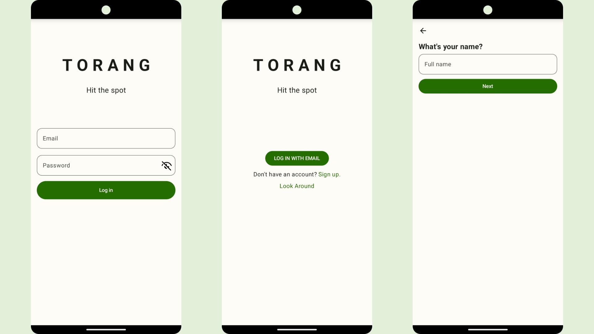
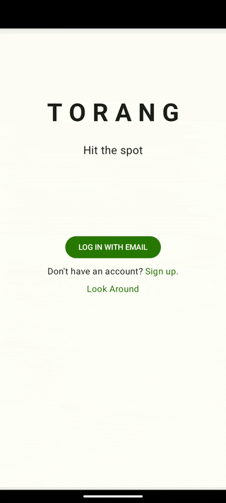

# Login Module



# 모듈 설명

로그인과 회원가입 기능을 제공하는 모듈.
인스타그램의 ui와 flow를 참조.
API와 DB는 저장소 모듈을 제공받아 사용하여
이 모듈에서는 UI Layer이 주된 구현 기능

# 개발 환경 구성

- app: login module을 실행하고 테스트하는 앱
- library: login module이 실제 구현되어 있는 라이브러리
- di: app에 위치하여 실제 라이브러리에 필요한 의존성을 제공하는 필수 코드
    - repository - 저장소(API, DB) 모듈을 주입하여 사용
    - login - login 모듈을 사용하는데 있어 필요한 의존성 정의

### 라이브러리 개발 시 사용 하는 모듈

- repository - 실제 앱의 저장소(API, DB 등)가 필요 시 사용
- theme - 화면의 공통 UI를 적용 하는데 사용

# Feature
- [UI Layer](./Documents/UILayer.md)
- [Navigation component](./Documents/Navigation.md)
- [JetPack Compose](Documents/jetpack_compose/JetpackCompose.md)
- [Testing](./Documents/Testing.md)

# 코드 설명

```
LoginNavHost --- SignInSignUpExploreNavHost  --- EmailLoginScreen
                 (로그인 회원가입 선택화면)        |   (이메일 로그인 화면)
                                             --- SignInSignUpExplore
                                                 (회원가입 화면)
```

## LoginNavHost.kt

로그인 화면의 경로들을 정의. 실질적인 화면의 시작점 이다.
SignInSignUpExploreNavHost - 로그인, 회원가입 선택화면
SignUpNavHost - 회원 가입 화면
가 선언되어 있다.

## SignInSignUpExploreNavHost.kt

로그인 회원가입 선택화면.
SignInSignUpExplore

## SignInSignUpExplore.kt

로그인 회원가입 선택 UI

# Screen Definition

- LoginNavHost
    - 로그인 방법 선택 (현재 이메일만 있음.)
    - 회원가입 화면 이동
- SignUpNavHost
    - 회원가입 네비게이션 화면
    - 이름 입력
    - 이메일 입력
    - 비밀번호 (확인) 입력
    - 회원가입 성공
- LoginChooseMethodNavHost
    - 이메일 로그인, 둘러보기, 회원가입 버튼
- EmailLoginScreen
    - 이메일 입력하여 로그인

# navigation을 한 곳에서 관리하고 싶은데, 로고 애니메이션 일관성 유지를 위해 따로 사용

LoginNavHost 말고도 여러 하위 navigation들이 있는데 화면 이동 시 마다 깜빡이는 현상이 있어서
로고 UI 애니메이션 또는 상단 뒤로가기 버튼 등이 깜빡이지 않도록 UI 일관성을 유지하기위해
navigation을 나눔.


# What was difficult

- 처음 적용해보는 Unitest 코드
    - UI가 제대로 나오는지 확인, API 호출 테스트 등
    - 로직 변경 시 unittest를 통해 먼저 테스트 할 수 있어 앱에서 실제로 동작하지 않아도 오류를 미리 파악 할 수 있어 유용
- 레이아웃 최적화
    - 회원 가입 화면에서 페이지 이동시마다 TopAppBar를 복붙으로 다 적용해 비효율적
    - 바깥으로 빼는 과정을 작업해줘야 해서 작업시간이 길어짐
    - 빠르게 화면을 만드는것도 중요하지만 개발 전 조금 더 생각 필요성 느낌
- 생각보다 신경써야 할 게 많은 로직
    - 회원가입 시 마다 입력 값에 대한 유효성 체크 및 UI 표시
    - 이메일 인증 등

# Preview


