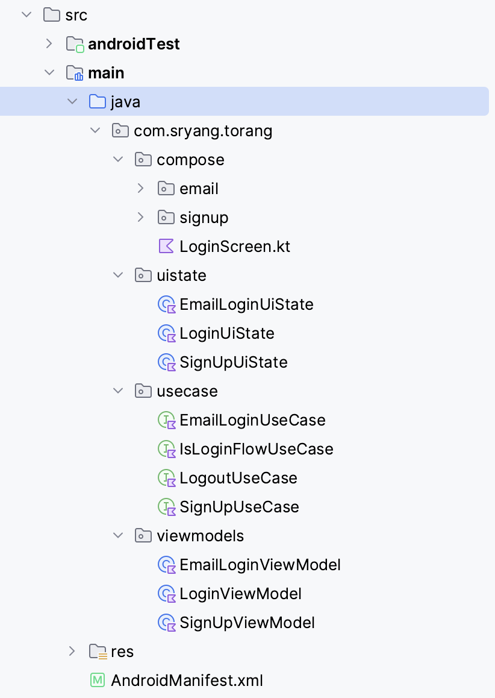
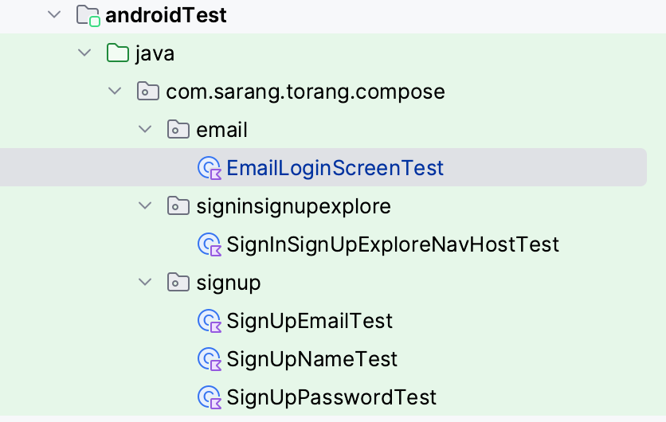

# Login Module


## Requirement

### functional

- 사용자는 이메일 주소와 비밀번호를 입력하여 로그인할 수 있습니다.
- 사용자는 "회원가입" 버튼을 클릭하여 회원가입 화면으로 이동할 수 있습니다.
- 사용자는 "둘러보기" 버튼을 클릭하여 로그인하지 않고도 앱을 둘러볼 수 있습니다.
- 사용자는 이메일 주소, 비밀번호, 또는 소셜 계정으로 로그인할 수 있습니다.
- 사용자는 로그인에 실패한 경우 오류 메시지를 확인할 수 있습니다.
- 사용자는 계정 찾기 또는 비밀번호 찾기 기능을 사용하여 계정에 액세스할 수 있습니다.

- 이메일/비밀번호 로그인
    - 사용자는 이메일 주소와 비밀번호를 입력하여 로그인할 수 있습니다.
    - 이메일 주소는 필수 입력 항목입니다.
    - 비밀번호는 필수 입력 항목입니다.
    - 로그인에 성공한 경우, 사용자는 앱의 메인 화면으로 이동합니다.
    - 로그인에 실패한 경우, 사용자는 오류 메시지를 확인할 수 있습니다.

- 소셜 계정 로그인
    - 사용자는 Facebook, Google, 또는 Twitter 계정으로 로그인할 수 있습니다.
    - 로그인에 성공한 경우, 사용자는 앱의 메인 화면으로 이동합니다.
    - 로그인에 실패한 경우, 사용자는 오류 메시지를 확인할 수 있습니다.

- 계정 찾기/비밀번호 찾기
    - 사용자는 계정 찾기 또는 비밀번호 찾기 기능을 사용하여 계정에 액세스할 수 있습니다.
    - 계정 찾기 기능을 사용하면, 사용자는 이메일 주소를 입력하여 계정 정보를 확인할 수 있습니다.
    - 비밀번호 찾기 기능을 사용하면, 사용자는 이메일 주소와 계정 이름을 입력하여 비밀번호를 재설정할 수 있습니다.

### Non-functional

- 로그인 화면은 모든 기기에서 최적의 화면 크기로 표시되어야 합니다.
- 로그인 화면의 버튼은 사용자에게 명확하게 구분되어야 합니다.
- 로그인 화면은 사용하기 쉽고 직관적이어야 합니다.

### Screen Definition

- LoginNavHost
  - 로그인 방법 선택 (현재 이메일만 있음.)
  - 회원가입 화면 이동
- SignUpNavHost
  - 회원가입 네비게이션 화면
  - 이름 입력
  - 이메일 입력
  - 비밀번호 (확인) 입력
  - 회원가입 성공
- LoginChooseMethodNavHost
  - 이메일 로그인, 둘러보기, 회원가입 버튼
- EmailLoginScreen
  - 이메일 입력하여 로그인

## Convention

### package



### Function

- Login + Screen
- SignUp + Screen
- EmailLogin + Screen

- EmailLogin + UseCase
- IsLoginFlow + UseCase
- Logout + UseCase
- SignUp + UseCase

- EmailLogin + ViewModel
- Login + ViewModel
- SignUp + ViewModel

## Architecture

### UI Layer

#### UI element

UI elements such as activities and fragments that display the data

- OutlinedTextField
    - supportingText : 입력 필드 하단에 작은 글씨로 정보 제공
    - trailingIcon : 입력 필드 끝에 아이콘 배치
    - keyboardOptions : 키보드 엔터 자리 다른 버튼으로 변경 가능
    - keyboardActions : 탭키나 엔터 키 눌렀을 때 다음 필드로 입력 가능하게 설정 가능

#### UI state

- The UI state is what the app says they should see.
- UI can be encapsulated in a UiState data class

```
data class EmailLoginUiState(
    val email: String = "",
    val password: String = "",
    val isProgress: Boolean = false,
    val error: String? = null,
    val emailErrorMessage: String? = null,
    val passwordErrorMessage: String? = null
)
```

```
data class SignUpUiState(
    val name: String = "",
    val email: String = "",
    val confirmCode: String = "",
    val password: String = "",
    val isProgress: Boolean = false,
    val emailErrorMessage: String? = null,
    val passwordErrorMessage: String? = null,
    val confirmCodeErrorMessage: String? = null
)
```

#### State holder(ViewModel)

Responsible for the production of UI state and contain the necessary logic for that task

```
```

## Illustrating cycle of event


## UnitTest
### package


### compose test
- 문구들이 나오는지 주로 작성
- 파라미터에 따라 navigation up 버튼 나오는지 테스트
```
@RunWith(AndroidJUnit4::class)
class SignInSignUpExploreNavHostTest {

//    @get:Rule
//    val composeTestRule = createComposeRule()

    @get:Rule(order = 1)
    val composeTestRule = createAndroidComposeRule<ComponentActivity>()

    @Before
    fun setUiState() {
        composeTestRule.setContent {
            SignInSignUpExploreNavHost(
                showTopBar = true,
                onLookAround = {},
                onSignUp = {},
                isLogin = false,
                showLookAround = true
            )
        }
    }

    @Test
    fun showTopBarTest() {
        composeTestRule.onNodeWithContentDescription(
            label = composeTestRule.activity.getString(R.string.a11y_back)
        ).assertIsDisplayed()
    }

    @Test
    fun checkEmailElement() {
        composeTestRule.onNodeWithText(
            composeTestRule.activity.getString(R.string.login_with_email)
        ).assertIsDisplayed()
        composeTestRule.onNodeWithText(
            composeTestRule.activity.getString(R.string.login_with_email)
        ).performClick()
    }

    /*@Test
    fun checkHitTheSpotElement() {
        composeTestRule.onNodeWithText("Hit the spot").assertIsDisplayed()
        composeTestRule.onNodeWithText("Hit the spot").performClick()
    }*/

    @Test
    fun checkSignUpElement() {
        composeTestRule.onNodeWithText(
            composeTestRule.activity.getString(R.string.sign_up)
        ).assertIsDisplayed()
        composeTestRule.onNodeWithText(
            composeTestRule.activity.getString(R.string.sign_up)
        ).performClick()
    }

    @Test
    fun checkLookAroundElement() {
        composeTestRule.onNodeWithText(
            composeTestRule.activity.getString(R.string.look_around)
        ).assertIsDisplayed()
        composeTestRule.onNodeWithText(
            composeTestRule.activity.getString(R.string.look_around)
        ).performClick()
    }
}
```
### viewmodel test
- 잘못된 형식 이메일 입력 시 오류 데이터 발생하는지 확인
- 로그인 정보 입력하여 API 테스트
```
@RunWith(AndroidJUnit4::class)
@HiltAndroidTest
class EmailLoginViewModelTest {
    @get:Rule
    var hiltRule = HiltAndroidRule(this)

    @Inject
    lateinit var emailLoginService: EmailLoginUseCase

    @Inject
    lateinit var emailUseCase: ValidEmailUseCase

    @Inject
    lateinit var passwordUseCase: ValidPasswordUseCase

    private lateinit var viewModel: EmailLoginViewModel

    @Before
    fun init() {
        hiltRule.inject()
        viewModel = EmailLoginViewModel(
            emailUseCase = emailUseCase,
            emailLoginService = emailLoginService,
            passwordUseCase = passwordUseCase
        )
    }

    @Test
    fun invalidEmail() {
        runBlocking {
            viewModel.login(onLogin = {})
            //do business logic
            Assert.assertEquals("Error", viewModel.uiState.value.emailErrorMessage)
        }
    }

    @Test
    fun invalidPassword() {
        runBlocking {
            viewModel.login(onLogin = {})
            //do business logic
            Assert.assertEquals("Error", viewModel.uiState.value.passwordErrorMessage)
        }
    }

    @Test
    fun wrongLogin() {
        runBlocking {
            viewModel.onChangeEmail("sarang628@naver.com")
            viewModel.onChangePassword("bbbbb")
            viewModel.login(onLogin = {

            })
            //do business logic by api call
            delay(3000)
            Assert.assertEquals("로그인에 실패하였습니다.", viewModel.uiState.value.error)
        }
    }

    @Test
    fun collectLogin() {
        runBlocking {
            viewModel.onChangeEmail("sarang628@naver.com")
            viewModel.onChangePassword("aaaaa")
            viewModel.login(onLogin = {

            })
            //do business logic by api call
            delay(3000)
            Assert.assertEquals(null, viewModel.uiState.value.error)
        }
    }
}
```

## What was difficult
- 처음 적용해보는 Unitest 코드 
  - UI가 제대로 나오는지 확인, API 호출 테스트 등
  - 로직 변경 시 unittest를 통해 먼저 테스트 할 수 있어 앱에서 실제로 동작하지 않아도 오류를 미리 파악 할 수 있어 유용
- 레이아웃 최적화
  - 회원 가입 화면에서 페이지 이동시마다 TopAppBar를 복붙으로 다 적용해 비효율적
  - 바깥으로 빼는 과정을 작업해줘야 해서 작업시간이 길어짐
  - 빠르게 화면을 만드는것도 중요하지만 개발 전 조금 더 생각 필요성 느낌
- 생각보다 신경써야 할 게 많은 로직
  - 회원가입 시 마다 입력 값에 대한 유효성 체크 및 UI 표시
  - 이메일 인증 등

## Preview

